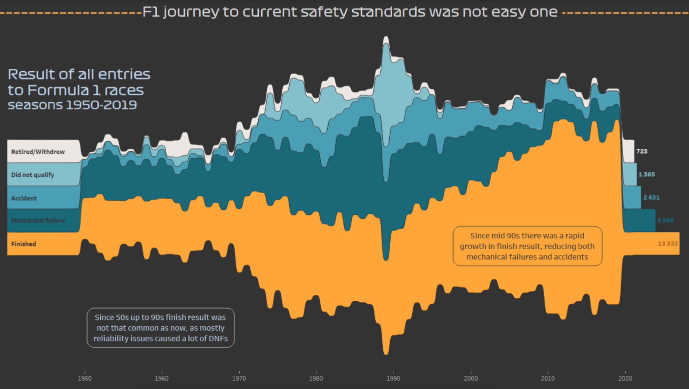

```{r setup, include=FALSE}
knitr::opts_chunk$set(echo = TRUE)
library(tidyverse)
library(dplyr)
```


## Overview

"F1 journey to current safety standards was not an easy one" is the claim the original graph made, which I am replicating in my visualization. I am working with numerical and categorical data. Specifically, the variables are the year, result of all entries, and the sum of the entries' results. The graph will show the count of the statuses of the entries by year, categorized by 5 status results.


## Visualization

```{r my-screenshot, echo=FALSE}

```


## Dataset

The original visualization was taken from [this article] (https://www.reddit.com/r/formula1/comments/j4fdcr/is_formula_1_still_drive_to_survive_take_a_look/). The dataset came from (http://ergast.com/mrd/db/#csv). The data was compiled by Ergast Developer API, who provides a historical record of motor racing data for non-commercial purposes. The data is free for me to use. Additionally, the data is raw and has not undergone much manipulation.

```{r load-data}
races <- read_csv("data/races.csv")
status <- read_csv("data/status.csv")
results <- read_csv("data/results.csv", col_types = cols(number = col_character()))
```

I used 3 csv files from the raw datasets. Each row represents an entry. There are `r nrow(races)` rows in "races," `r nrow(status)` rows in status, and `r nrow(results)` rows in results. The data is diverse, but mainly numeric, regressional data. Specifically, the data that I use is the status (categorical), sum of statuses (continuous), and years (continuous).


## Wrangling

I need to join the 3 datasets together using their keys. Specifically, I need the year and the statuses in one dataset.

```{r join datasets}
joined_results <- left_join(status, results, by='statusId') %>%
                left_join(races, results, by='raceId')
```


## Replication

```{r plotting the joined data}
joined_results %>%
  mutate(status = if_else((status == "Withdrew") |
                          (status == "Retired"),
                          "Withdrew/Retired",
                          status)) %>%                 # Mutate new a new status category
  filter(status == "Withdrew/Retired" |
         status == "Accident" |
         status == "Did not qualify" |
         status == "Mechanical" |
         status == "Finished") %>%                     # Filter 5 categories needed
  group_by(status, year) %>% 
  summarise(status_sum = n()) %>%
  ggplot(aes(x = year, 
             y = status_sum, 
             fill = reorder(status, status_sum))) +    # Create stacked bar graph
  geom_col() +
  labs(x = "year", 
       y = "number of statuses", 
       fill = "status", 
       title = "Result of all entries to Formula 1 races", 
       subtitle = "seasons 1950-2019")                 # Give label
```


## Analysis
The graph above demonstrates the count of the statuses of the entries by year, categorized by 5 status results. Specifically, the number of statuses controls the height of the graph while the years control the width. The statuses divide the data by color in the stacked bar chart. 

A difficulty I encountered was putting the cumulative count of the entries by status on the right side of the graph (similar to the original visualization). I did not overcome this challenge. However, a challenge that I did overcome was turning the graph from a group of separate columns into a stacked bar plot. 


## Alternative designs
Alternatively, I could make different design choices when I visualize the Formula 1 data. 

First, the original data chose to display the five status results of mechanical, withdrew/retired, accident, did not qualify, and finished. An alternative choice to demonstrate the results of the races could be only using the variables finished, mechanical, and accident. This alternative choice is superior to the original because it better suits the original claim that "F1 journey to current safety standards was not an easy one." Withdrew/retired and non-qualifying entries have nothing to do with entries that ended in unsafe ways. They manipulate the data to make the data compared to the safe "Finished" variable look larger (in an attempt to prove their point). This redesign can support the new claim that Formula 1 accidents and mechanical failures have decreased over the years while finishing results have increased. 

Second, the original data chose to not make each year's number of statuses per year by status distinct from each other. Instead, the number of statuses over the years is smoothed together. Alternatively, I would make each year's number of statuses by year by status visually set apart by points in a scatter plot. It supports their original claim better due to its demonstration of results over the course of years. This redesign can also support the new claim that Formula 1 accidents and mechanical failures have decreased over the years.

```{r Alternative design}
status_data <- joined_results %>%
  mutate(status = if_else((status == "Accident") |
                          (status == "Mechanical"),
                          "Accident/Mechanical",
                          status)) %>%                  # Mutate new a new category
  filter(status == "Accident/Mechanical" |
         status == "Finished") %>%                      # Filter 2 categories
  group_by(status, year) %>% 
  summarise(status_sum = n())

last_counts <- status_data %>%
  group_by(status) %>%
  slice_tail(n = 5) %>% 
  summarise(year = 2020, status_sum = mean(status_sum)) # Summarize last 5 years of statuses for the legend
  
status_data %>% 
  ggplot(aes(x = year, 
             y = status_sum, 
             color = reorder(status, status_sum))) +    # Create scatter plot
  geom_point() +
  geom_smooth() +
  geom_text(data = last_counts,              
                  aes(label = status),
                  direction = "y",
                  nudge_x = -5,
                  nudge_y = -20) +                      # Reformat legend
  theme(legend.position = "none") +
  labs(x = "year", 
       y = "number of status entries", 
       title = "Finished vs. Failure Results of Formula 1 Race Entries", 
       subtitle = "from 1950-2019")                     # Give label
```


## Summary

My understanding of the original claim has changed. The original claim is that the "F1 journey to current safety standards was not an easy one." After plotting the data differently using only data that is relevant to the claim, I found that implied rough start of Formula 1 races was not as bad as the original visualized. Yes, there were a significant proportion of accidents and failures in races in the beginning years. However, without withdrawn, retired, and non qualifying entries included in the graph, Formula 1 did not have as rough of a start as it appeared.

I was faithful to the original graph's purpose of displaying entry's statuses over time. The variables are the same, but I adjusted which statuses I divided the data by. I also changed the type of graph from a stacked bar chart to a scatter chart to better understand the trends of the statuses. 

I would say that my alternative design was very successful. It is easy to interpret, unlike the previous graph, and the graph is not manipulated to provoke an exaggerated conclusion. Specifically, I combined accidents and mechanical issues to make the distinction between failures and finished entries easier to see.

A follow-up question is how has the percentage of failures compared to finished entries change over time (instead of comparing the sums)? Also, are entries that have mechanical failures that get fixed during the race counted as finished and mechanical failure? Or, if they finish with a mechanical failure during the race are they counted only as finished?

I could extend this work into a final project by applying predictive modeling. I could predict the number of mechanical failures and accidents for 2021 and on.

After this whole experience, I feel thankful that I have grown my knowledge of data wrangling and visualization. Additionally, it feels satisfying to have corrected a confusing and manipulative graph. 

