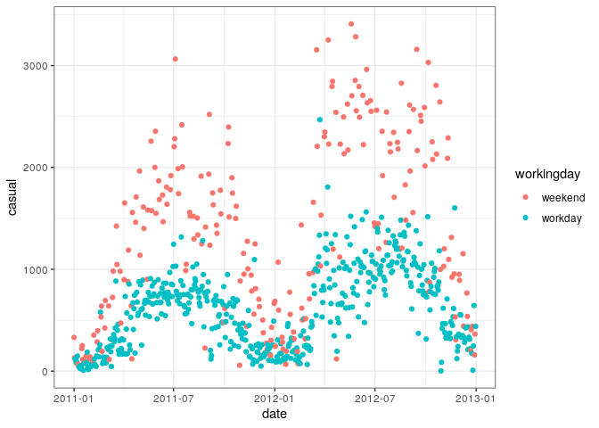

Homework 9: Predictive Modeling
================
Brea Koenes
11/07/2020

## Getting Started

### Load data

``` r
daily_rides <- read_csv("data/day-hw09.csv", col_types = cols_only(
  date = col_date(),
  year = col_integer(),
  workingday = col_character(),
  temp = col_double(),
  atemp = col_double(),
  casual = col_double(),
  registered = col_double()
)) %>% mutate(across(c(workingday, year), as_factor))
```

### Exploratory Analytics

``` r
daily_rides %>% ggplot(aes(x = date, y = casual, color = workingday)) + 
  geom_point()
```

<!-- -->

### Train-test split

``` r
train <- daily_rides %>% filter(year == 2011)
test <- daily_rides %>% filter(year == 2012) # only one of these produces the right amount of rows, and it doesn't use training/testing functions. But, its closer to the amount of rows we need
```

The training set has 365 days because it is a normal year and the
testing set has 366 days because 2012 is a leap year.

## Linear Regression using Temperature

``` r
model1 <- parsnip::linear_reg() %>% set_engine("lm") %>%
  fit(casual ~ temp, data = train)
```

### Look inside the model

``` r
model1 %>%
  tidy() %>%
  select(term, estimate)
```

    ## # A tibble: 2 x 2
    ##   term        estimate
    ##   <chr>          <dbl>
    ## 1 (Intercept)    138. 
    ## 2 temp            36.3

For every additional degree C, model1 predicts 36.3 additional riders.

### Predictions

``` r
train %>% add_predictions(model1) %>%
  ggplot(aes(x = date, y = casual, color = workingday)) +
  geom_point() +
  geom_line(aes(y = .pred, color = "prediction")) +
  labs(title = "Model 1 Prediction")
```

<!-- --> In
the formula in the fit model, we’re grouping casual riders by
temperature. This grouping by the temperature would explain why the
maroon line is not straight in a linear model.

### Residuals Histogram

``` r
train %>% add_predictions(model1) %>%
  mutate(resid = casual - .pred) %>%
  ggplot(aes(x = resid)) +
  geom_histogram(binwidth = 100) +
  geom_vline(xintercept = 0) +
  facet_wrap(~workingday, nrow = 2) +
  labs(x = "residual", title = "Model 1 Residuals")
```

<!-- -->

### Observed by Predicted

``` r
train %>% add_predictions(model1) %>%
  ggplot(aes(x = casual, y = .pred, color = workingday)) +
  geom_point(alpha = .4) +
  coord_obs_pred() +
  geom_abline() +
  labs(title = "Model 1 Observed-by-predicted")
```

<!-- -->
This model predicts too high when there are 0-1000 casual riders on a
workday. This is seen in the blue points above the line. The model
typically predicts too low on weekends that average between 1100-1400
casual riders. This is seen in the red points below the line.

The model might have done that because people might use a bike to
commute to work, whereas on weekends,= they do not need to because there
is not work.

### Validate the model on the test set

#### Predictions

``` r
daily_rides %>% add_predictions(model1) %>%
  ggplot(aes(x = date, y = casual, color = workingday)) +
  geom_point() +
  geom_line(aes(y = .pred, color = "prediction")) +
  labs(title = "Unseen Data Predictions")
```

<!-- -->

#### Residuals

``` r
daily_rides %>% add_predictions(model1) %>%
  mutate(resid = casual - .pred) %>%
  ggplot(aes(x = resid)) +
  geom_histogram(binwidth = 100) +
  geom_vline(xintercept = 0) +
  facet_wrap(~year, nrow = 2) + 
  labs(title = "Residuals by Year")
```

<!-- -->

#### Observed by Predicted

``` r
daily_rides %>%
  add_predictions(model1) %>%
  ggplot(aes(x = casual, y = .pred, color = year)) +
  geom_point(alpha = .4) +
  coord_obs_pred() +
  geom_abline()
```

<!-- -->

### Quantify errors

``` r
model1 %>% 
  predict(daily_rides) %>%
  bind_cols(daily_rides) %>%
  group_by(year) %>%
  mae(truth = casual, estimate = .pred)
```

    ## # A tibble: 2 x 4
    ##   year  .metric .estimator .estimate
    ##   <fct> <chr>   <chr>          <dbl>
    ## 1 2011  mae     standard        331.
    ## 2 2012  mae     standard        446.

On average, the 2011’s prediction is 331 from the correct amount. In
2012, the prediction is 446 away from the correct amount on average.

#### Summarize

The model performs well on the training set. The training set performs
much better than the testing set. Compare the “quantify errors” table
above with the plots of model performance. On the plots, you can see the
range of the data and the errors colored by workingday on the training
set. From the tables, you can see the mean average error in numeric
form.

## Linear Regression using Temperature and Working Day

``` r
recipe2 <-
  recipe(casual ~ temp + workingday, data = train) %>%
  step_dummy(workingday) %>%
  step_interact(~ temp:starts_with("workingday"))

model2 <- workflow() %>%
  add_recipe(recipe2) %>%
  add_model(linear_reg()) %>%
  fit(train)
```

``` r
model2 %>% tidy() %>% select(term, estimate)
```

    ## # A tibble: 4 x 2
    ##   term                      estimate
    ##   <chr>                        <dbl>
    ## 1 (Intercept)                  251. 
    ## 2 temp                          61.0
    ## 3 workingday_workday          -190. 
    ## 4 temp_x_workingday_workday    -33.8

``` r
train %>% add_predictions(model2) %>%
  ggplot(aes(x = date, y = casual, color = workingday)) +
  geom_point() +
  geom_line(aes(y = .pred)) +
  labs(title = "Model 2 Predictions")
```

<!-- -->

``` r
ggplot(data = train, aes(x = temp, y = casual, color = workingday)) +
  geom_point() +
  geom_line(
    data = expand_grid(
      workingday = levels(train$workingday),
      temp = modelr::seq_range(train$temp, n = 100)
    ) %>% 
      add_predictions(model2), mapping = aes(y = .pred))
```

<!-- -->

``` r
model2 %>% 
  predict(daily_rides) %>%
  bind_cols(daily_rides) %>%
  group_by(year) %>%
  mae(truth = casual, estimate = .pred)
```

    ## # A tibble: 2 x 4
    ##   year  .metric .estimator .estimate
    ##   <fct> <chr>   <chr>          <dbl>
    ## 1 2011  mae     standard        200.
    ## 2 2012  mae     standard        392.

## Decision Tree Regression

``` r
set.seed(0)
model3 <- 
  decision_tree(mode = "regression", tree_depth = 3) %>%
  set_engine("rpart") %>%
  fit(casual ~ temp +workingday, data = train)
```

``` r
model3 %>%
  pluck("fit") %>%
  rpart.plot::rpart.plot(roundint = FALSE, digits = 3, type = 4)
```

<!-- -->

``` r
train %>%
  add_predictions(model3) %>%
  ggplot(aes(x = date, y = casual, color = workingday)) +
  geom_point() +
  geom_line(aes(y = .pred)) +
  labs(title = "Model 3 Predictions")
```

<!-- -->

``` r
model3 %>%
  predict(daily_rides) %>%
  bind_cols(daily_rides) %>%
  group_by(year) %>%
  mae(truth = casual, estimate = .pred)
```

    ## # A tibble: 2 x 4
    ##   year  .metric .estimator .estimate
    ##   <fct> <chr>   <chr>          <dbl>
    ## 1 2011  mae     standard        185.
    ## 2 2012  mae     standard        383.

``` r
daily_rides %>% add_predictions(model1, model2, model3) %>%
  group_by(year, model) %>%
  mae(truth = casual, estimate = .pred) %>%
  ggplot(aes(x = model, y = .estimate, fill = year)) +
  geom_col(position = "dodge")
```

<!-- -->

## Wrap-up

The linear regression and decision tree models differ. The decision tree
model’s trend lines fit the data better; the lines are straighter and
more understandable. Also, there is slightly less variance in the errors
in the decision tree model.

The linear regression models performed worse than the decision tree
model when it came to 2011’s and 2012’s MAE. Between the two years, 2011
tended to be more accurate.

There are multiple explanations for why 2011 and 2012’s prediction
accuracy is different. First, we group casual riders by temperature in
the models. This means that if the temperatures differed in 2012, the
predictions would be off. There is another explanation: in 2011, the MAE
was impacted by the differing amounts of bikes used on work days and
weekends. In 2012, if the gap between the amount of riders on work days
and weekends increased, it would also have impacted the MAE, especially
in the linear regression models. These explanations shed light on why
the prediction’s accuracy levels differ between the two years.
