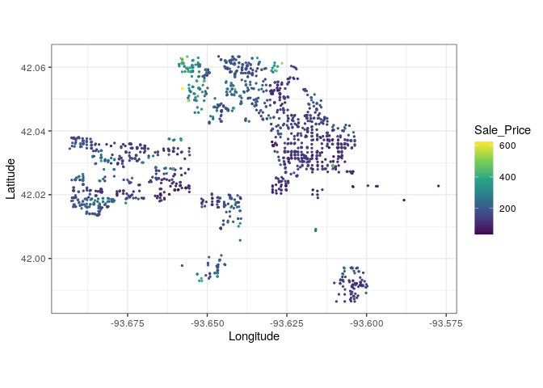
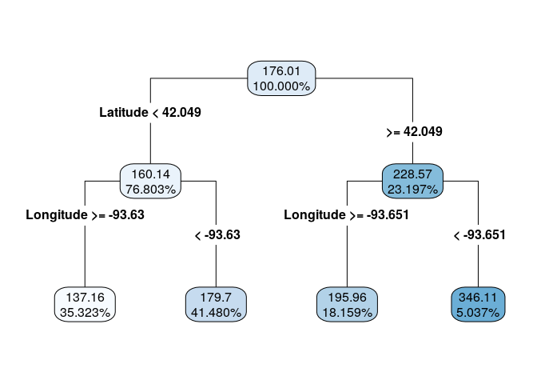
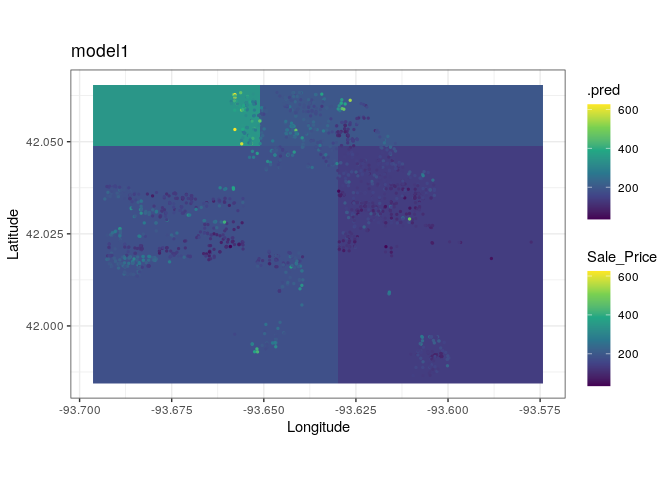
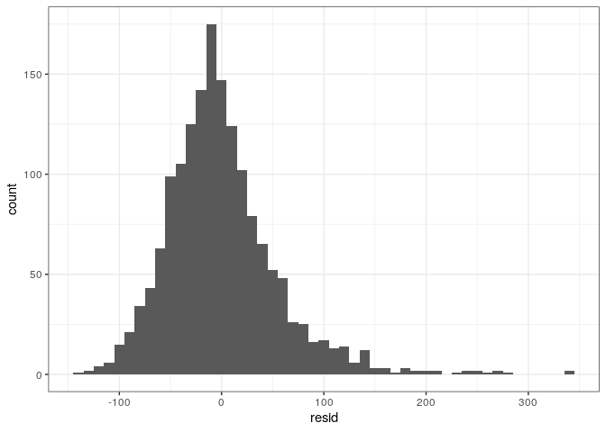
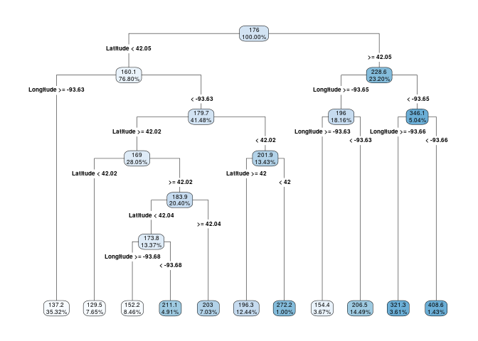
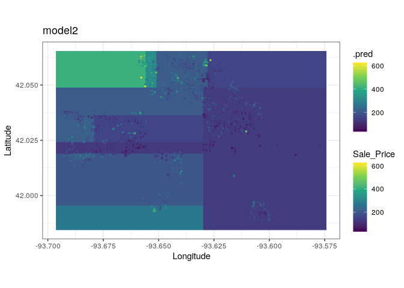
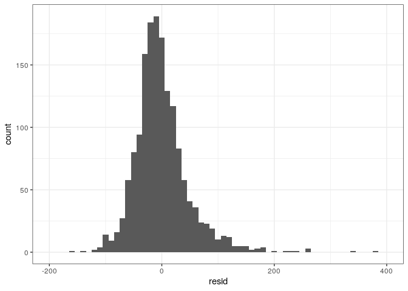
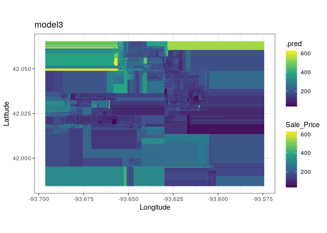
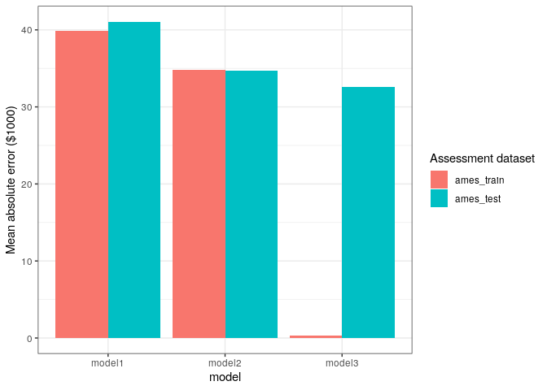

Lab 09: Over-fitting
================
Jacob Gregor, Brea Koenes
11-02-2020

``` r
usethis::use_git_config(scope = "user", "credential.helper" = "cache --timeout=10000000")
```

## Data

We’ll again be using the Ames home sales dataset. Again, see [Data
dictionary](http://jse.amstat.org/v19n3/decock/DataDocumentation.txt).
And again, we use a subset of the original data as suggested by the
[original paper](http://jse.amstat.org/v19n3/decock.pdf).

We’ll also scale the sale price to be in units of $1000, to keep the
numbers more manageable.

``` r
data(ames, package = "modeldata")
ames_all <- ames %>%
  filter(Gr_Liv_Area < 4000, Sale_Condition == "Normal") %>%
  mutate(across(where(is.integer), as.double)) %>%
  mutate(Sale_Price = Sale_Price / 1000)
rm(ames)
```

We’ll use the same train-test split that we have been using:

``` r
set.seed(10) # Seed the random number generator
ames_split <- initial_split(ames_all, prop = 2 / 3) # Split our data randomly
ames_train <- training(ames_split)
ames_test <- testing(ames_split)
```

## Constructing Models

### Visualizing the predictions in “data space”

### Excerise 1

``` r
ggplot(ames_train, aes(x = Longitude, y = Latitude, color = Sale_Price)) +
  geom_point(size = .5) +
  scale_color_viridis_c() +
  coord_equal()
```

<!-- -->

``` r
set.seed(0)
model1 <-
  decision_tree(mode = "regression", tree_depth = 2) %>%
  set_engine("rpart") %>%
  fit(Sale_Price ~ Latitude + Longitude, data = ames_train)
```

``` r
model1 %>%
  pluck("fit") %>%
  rpart.plot(roundint = FALSE, digits = 5, type = 4)
```

<!-- -->
\#\#\# Excerise 2

Since the latitude is less than 42.049 and the longitude is equal to
-93.63, the sales price of the house is 137.16 (35.32%).

Make a grid that roughly covers the city of Ames.

``` r
lat_long_grid <- expand_grid(
  Latitude  = modelr::seq_range(ames_train$Latitude,  n = 200, expand = .05),
  Longitude = modelr::seq_range(ames_train$Longitude, n = 200, expand = .05),
)
```

We start by defining a utility function that takes a data frame and adds
a model’s predictions onto it.

``` r
add_predictions <- function(data, model, variable_name = ".pred", model_name = deparse(substitute(model))) {
  model %>%
    predict(data) %>%
    rename(!!enquo(variable_name) := .pred) %>%
    mutate(model = model_name) %>%
    bind_cols(data)
}
```

And here’s another utility function, to show a model’s predictions:

``` r
show_latlong_model <- function(dataset, model, model_name = deparse(substitute(model))) {
  ggplot(dataset, aes(x = Longitude, y = Latitude)) +
    geom_raster(
      data = lat_long_grid %>% add_predictions(model, model_name = model_name),
      mapping = aes(fill = .pred)
    ) +
    geom_point(aes(color = Sale_Price), size = .5) +
    scale_color_viridis_c(aesthetics = c("color", "fill")) +
    coord_equal() +
    labs(title = model_name)
}
```

``` r
show_latlong_model(ames_train, model1)
```

<!-- -->

``` r
ames_train %>%
  add_predictions(model1) %>%
  mutate(resid = Sale_Price - .pred) %>%
  ggplot(aes(x = resid)) +
    geom_histogram(binwidth = 10)
```

<!-- -->

``` r
ames_train %>%
  add_predictions(model1) %>%
  # summarize(mae = mean(abs(Sale_Price - .pred)))
  mae(truth = Sale_Price, estimate = .pred)
```

    ## # A tibble: 1 x 3
    ##   .metric .estimator .estimate
    ##   <chr>   <chr>          <dbl>
    ## 1 mae     standard        39.9

``` r
model2 <-
  decision_tree(mode = "regression", tree_depth = 30) %>%
  set_engine("rpart") %>%
  fit(Sale_Price ~ Latitude + Longitude, data = ames_train)
```

``` r
model2 %>%
  pluck("fit") %>%
  rpart.plot(roundint = FALSE, digits = 4, type = 4)
```

<!-- -->

``` r
show_latlong_model(ames_train, model2)
```

<!-- -->

### Exercise 3

Model 1 and model 2 have similar results. They both have similar dollar
amounts of sales prices spotted throughout the model. However, they
differ when it comes to the number of divisions of sale prices they
have. Model 1 has four larger, dominant divisions of sales price. Model
2 has about 10. Model 2 also has a larger range of sales prices, which
are a bit higher in price than model 1’s.

``` r
ames_train %>%
  add_predictions(model2) %>%
  mutate(resid = Sale_Price - .pred) %>%
  ggplot(aes(x = resid)) +
  geom_histogram(binwidth = 10) +
  coord_cartesian(xlim = c(-200, 400))
```

<!-- -->

``` r
ames_train %>%
  add_predictions(model2) %>%
  mae(truth = Sale_Price, estimate = .pred)
```

    ## # A tibble: 1 x 3
    ##   .metric .estimator .estimate
    ##   <chr>   <chr>          <dbl>
    ## 1 mae     standard        34.8

## Exercise 4

As seen in the bar graphs that analyze the errors, the residuals changed
between model1 and model2. Model 1’s residuals were concentrated at
about -20 while model 2’s were concentrated at about 0. Model 2 is more
accurate than model as seen in the MAE; On average, the predictions of
model 2 are 5.1152 more accurate than model 1.

``` r
model3 <-
  decision_tree(mode = "regression", cost_complexity = 1e-6, min_n = 2) %>%
  set_engine("rpart") %>%
  fit(Sale_Price ~ Latitude + Longitude, data = ames_train)
```

``` r
show_latlong_model(ames_train, model3)
```

<!-- -->

## Exercise 5

Model 3 has significantly more divisions than model 1 and 2. It has so
many divisions that it is sometimes hard to tell them apart and draw
distinct conclusions—it looks very busy. Model 2 is better at drawing
conclusions becuase it is more detailed than model 1 but not as
confusing as model 3.

``` r
ames_train %>%
  add_predictions(model3) %>%
  mutate(resid = Sale_Price - .pred) %>%
  ggplot(aes(x = resid)) +
  geom_histogram(binwidth = 1) +
  coord_cartesian(xlim = c(-200, 400))
```

<!-- -->

``` r
ames_train %>%
  add_predictions(model3) %>%
  mae(truth = Sale_Price, estimate = .pred)
```

    ## # A tibble: 1 x 3
    ##   .metric .estimator .estimate
    ##   <chr>   <chr>          <dbl>
    ## 1 mae     standard       0.329

## Exercise 6

Model 3 makes its predictions on a decision tree that has a large amount
of divisions. It’s predictions are better than the other models as it
has a MAE of 0.328825.

## Validation

``` r
all_resids <- expand_grid(
  model = c("model1", "model2", "model3"),
  data = c("ames_train", "ames_test")
) %>%
  pmap_dfr( # Run this function on all of the data points, binding rows of results together.
    function(model, data) {
      get(data) %>%
        add_predictions(get(model)) %>%
        mutate(resid = Sale_Price - .pred) %>%
        mutate(model = !!model, data = !!data)
    }
  ) %>%
  mutate(data = fct_relevel(data, "ames_train", "ames_test"))
```

``` r
all_resids %>%
  group_by(model, data) %>%
  summarize(mae = mean(abs(Sale_Price - .pred))) %>%
  ggplot(aes(x = model, y = mae, fill = data)) +
  geom_col(position = 'dodge') +
  labs(y = "Mean absolute error ($1000)", fill = "Assessment dataset")
```

<!-- -->

## Exercise 7

The first model has the largest mean average error and the least amount
of decision tree divisions. The second model has more divisions than
model 1 and is more detailed, along with a smaller MAE. The third
model’s MAE is the lowest, making it the most accurate model.
Howeveer, the amount divisions in its decision tree makes the
visualization of it with sales price messy. It is hard to interpret due
to the amount of visualized divisions.

Overall, model 2 is easier to visualize and understand and model 3 is
the most accurate.
